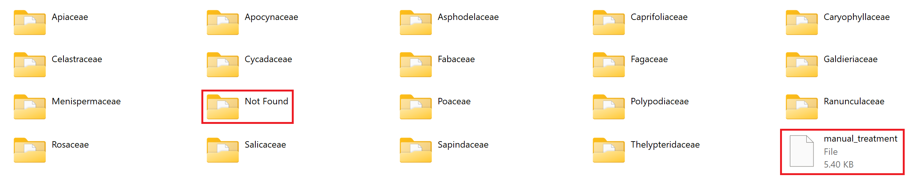
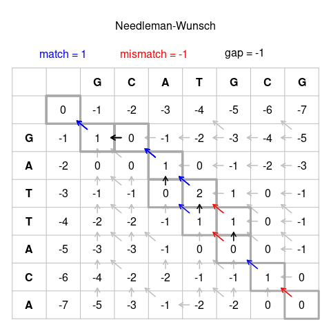

# DNA identification 

## Goal of the project
### GenoRobotics
GenoRobotics is an interdisciplinary project associating engineers, scientists and students towards the development of a portable device enabling field DNA analysis. The main goal of the association is to develop a miniaturized tool to automatically process samples into the field and accelerate biodiversity identification

### Bioinformatic
The bioinformatic team of the association was split in three different project : 
- Database project : Create our own database to store all the information collected and not depend on an external agent.
- Consensus sequence : Find the consensus sequence of the sequence extracted from nanopore sequencing of a plant.
- Identification project : Compare this consensus sequence with a database to find wich plant it is. 

### Identification Project
The goal of this project was to find a way to compare a DNA sequence with a large database as fastest as possible. 
The first step was about the database. We had to find a way to download the ncbi database to use it locally on our computer.
The second step was to find an algorithm efficient to compare the DNA sequence with several tens of thousands sequence. We have to compare the 4 gene extracted from the plant (MatK, rbcL, psbA-trnH, ITS) with nanopore sequencing with this database to find which plant it is,  or,  if this plant is not in the database, the closest plant to it. To do that we use the Needleman-Wunsch algorithm. 

## Download the useful database
To improve the efficiency of the algorithm you have to download only the part of the database of your interest. With the nanopore sequencing using MinION technologie, we extract 4 genes (MatK, rbcL, psbA-trnH, ITS) so it's important to download the database of these genes. 
To download the best database possible please follow this few rules :
- Go on the website: https://www.ncbi.nlm.nih.gov/nuccore
- Enter the gene you need (MatK, rbcL, psbA-trnH, ITS)
- Select the length of the sequence of interest with [Sequence length] on the left (allow to select less sequence and only the sequence of interest)
Example of length : 
    - MatK : 750 to 1500 -> ~110k Sequence, ~90Mo
    - rbcL : 600 to 1000 -> ~90k Sequence, ~80Mo
    - psbA-trnH : 400 to 800 -> ~60k Sequence, ~40Mo
- Download it to have the information and the DNA sequence 
Click and send to (corner top right) > Complete Record > File > Format = Fasta > Sort by : (as you want it's not important)

## Reorganization of the database

From the previous step, we obtain four files, one for each of the barcoding genes. Each file contains the sequences for all of the sequenced species in the taxon Viridiplantae (Green plants). However, to optimize the run time for the identification of the sample, we might want to compare the given sequences only with sequences from a given family. We might indeed imagine that a field biologist is able to discern a sample's family from its morphological characteristics, making the comparison of the sequence with the entire database useless. Hence the need to reorganize our gene database according to family.

The new database is thus organized as follows:
- it contains folders named after the different families found in the initial database.
- Each folder consists of four csv files for the four genes, each containing the corresponding sequences.
- One csv file named "manual_treatment" outside of any folder contains sequences for which the binomial nomenclature could not be extracted from the description.
-   One folder named "Not Found" contains sequences for which the binomial nomenclature was **supposedly** well extracted but the corresponding family was not found.

This reorganization involves two steps:
- extracting the useful information from a gene entry's description (id, genus, species).
- deriving the family from the binomial nomenclature obtained previously.

### extracting information

the difficulty of this step comes from the fact that, while conventions for describing entries for gene sequences in GenBank exist, there is no uniformed format for writing these descriptions.
We present here a few examples:

> gi|1463932682|gb|MF446965.1| [Belvisia] revoluta voucher 386 maturase K (matK) gene, partial cds; chloroplast

> LC490112.1 Capparis sp. MA-2019 chloroplast MIR:2121a gene for psbA gene and psbA-trnH intergenic spacer, partial sequence

> KP318801.1 UNVERIFIED: Paramignya trimera psbA-trnH intergenic spacer, partial sequence; chloroplast

> X83991.1 G.glabra chloroplast rbcL gene, promoter region

From the study of the different descriptions found in the initial database, we notice these problems.
- the presence of keywords with unpredictable positions in the description
- the abbreviation of genuses and species' names in certain descriptions
- and this list is **not exhaustive**

Our approach is to treat the description word by word, identifying the genus then the species and ignoring keywords along the way. If the supposed family or species name contains special characters, we send the sequence to manual_treatment.csv. This way, these unusual sequences can be entered manually into the new database and/or can reveal new special cases to be taken into consideration.

Here is a table of the common keywords identified and the way we deal with them:

| keyword | meaning | treatment |
| --- | --- | --- |
| sp. | ----- | skip |
| var. | ----- | skip |
| uncultured | ----- | skip |
| unverified | ----- | skip |

### Finding the family

from the binomial nomenclature found in the first step, we use the Entrez library to access the NCBI taxonomy database and get the family. However, accessing the online database for every gene sequence significantly increases the run time of the reorganization code.

### Using the reorganization code

The function `build_database()` executes all the necessary steps to construct the new database. Some naming conventions must be adopted for it to work. The initial database should be in a folder in the working directory called "Database". The four gene files inside it must be named exactly as follows:

> sequences_matK_800-1550.fasta

> psbA-trnH_sequence.fasta

> rcbL_sequence.fasta

> its

The function builds the database inside a new folder called "Database_by_family". Thus, the working directory should not already contain a folder with that name.

## Algorithme Needleman-Wunsch
The Needleman-Wunsch algorithm is an algorithm that performs a maximum global alignment of two DNA sequences. It is commonly used in bioinformatics to align protein or nucleotide sequences. The Needleman-Wunsch algorithm is an example of dynamic programming, it guarantees to find the maximum score alignment. To determine the maximum score alignment, a two-dimensional array, or matrix, is used. There is one row for each character in sequence A, and one column for each character in sequence B. So, if we align sequences of size n and m, the execution time of the algorithm is O(nm), and the memory space used is O(nm) too.

The algorithm is executed in three steps: 

1. Calculation of the similarity matrix, matrix S. For each cell of the matrix we assign a score Z if the nucleotide of sequence A is equal to that of sequence B and a score Y if there is a substitution

2. Then we calculate the optimal matrix, matrix M. For each cell of M(i,j), we take the maximum between 3 cases: 
M(i,j) = max (M(i-1, j-1)+S(i,j), M(i-1, j)+g, M(i, j-1) + g)
with g being the weight assigned to the gap. 

3. We look at the matrix M from the last cell to the first. For each cell we go to the best score between the 3 before. So for the cell M(i, j), we look at M(i, j-1), M(i-1, j) and M(i-1, j-1) and we keep only the best score. 

Finally this gives us an optimal alignment of the two sequences with gaps and shifts.

## Implementation
Library: Only two library are used: Numpy, Pandas and Biopython. From Biopython we only use SeqIO to parse the fasta files and pairwise2 to align two DNA sequence. 

utils.py : All the function use to preprocess the file : 
- parse_sequence : Parse the database in a dictionnary, Sequence information are the keys and DNA sequence are the values.
- parse_database : Parse the sequence in a list. 
- replace_nucleotide : Verify if the sequence provide is completely correct, if not change the nucleotide by a '-'. This choice is a personal choice to make the computation easier and reduce the runtime. Could be change to improve the accuracy. 
- nucleotide_uppercase : Put all the sequence in uppercase

algo.py : All the function about the algorithm
- global_align : Needleman-Wunsch algorithm, compare two sequence to find the alignment and the matching score. Could be a bit long. Work with score_align() to compute the alignment score
- bioalign : Needleman-Wunsch algorithm coding in the library biopython, compare the sequence with all the database to find the sequence with the best alignment and the best matching score. It's the fastest method. 
- align : Compute the alignment and the score using the different function above

Identification_GR.py : main function to run the programm.

## Utilisation
To use this project you have to clone the main repository and use the following command line in the terminal.

\python Identification_GR.py [DATABASE_PATH] [SEQUENCE_PATH] [ALGORITHM]

DATABASE_PATH = The path of your database (must be a fasta file)
SEQUENCE_PATH = The path of your sequence (must be a fasta file)
ALGORTHM = 3 possible choice of algorithm : 
- [1] : To compare your sequence with all the database, only the best matching score will return
- [2] : To align your sequence with another sequence, return the best alignment and the matching score (in percent). 
Use global_algo, a Needleman-Wunsch Algorithm coding by myself 
- [3] : To align your sequence with another sequence, return the best alignment in a different way and the matching score. 
Use a Needleman-Wunsch Algorithm using the librart Biopython.

## Result
[Test done with a Windows Surface 7]

Result for psbA-trnH with option 1: 

Result for rbcL with option 1:

Result for matK with option 1:

