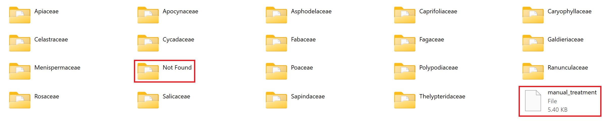

# Reorganization of the database

After downloading the gene databases from NCBI we obtain four files, one for each of the barcoding genes. Each file contains the sequences for all of the sequenced species in the taxon Viridiplantae (Green plants). However, to optimize the run time for the identification of the sample, we might want to compare the given sequences only with sequences from a given family. We might indeed imagine that a field biologist is able to discern a sample's family from its morphological characteristics, making the comparison of the sequence with the entire database useless. Hence the need to reorganize our gene database according to family.

The new database is thus organized as follows:
- it contains folders named after the different families found in the initial database.
- Each folder consists of four csv files for the four genes, each containing the corresponding sequences.
- One csv file named "manual_treatment" outside of any folder contains sequences for which the binomial nomenclature could not be extracted from the description.
-   One folder named "Not Found" contains sequences for which the binomial nomenclature was **supposedly** well extracted but the corresponding family was not found.

This reorganization involves two steps:
- extracting the useful information from a gene entry's description (id, genus, species).
- deriving the family from the binomial nomenclature obtained previously.

### extracting information

the difficulty of this step comes from the fact that, while conventions for describing entries for gene sequences in GenBank exist, there is no uniformed format for writing these descriptions.
We present here a few examples:

> gi|1463932682|gb|MF446965.1| [Belvisia] revoluta voucher 386 maturase K (matK) gene, partial cds; chloroplast

> LC490112.1 Capparis sp. MA-2019 chloroplast MIR:2121a gene for psbA gene and psbA-trnH intergenic spacer, partial sequence

> KP318801.1 UNVERIFIED: Paramignya trimera psbA-trnH intergenic spacer, partial sequence; chloroplast

> X83991.1 G.glabra chloroplast rbcL gene, promoter region

From the study of the different descriptions found in the initial database, we notice these problems.
- the presence of keywords with unpredictable positions in the description
- the abbreviation of genuses and species' names in certain descriptions
- and this list is **not exhaustive**

Our approach is to treat the description word by word, identifying the genus then the species and ignoring keywords along the way. If the supposed family or species name contains special characters, we send the sequence to manual_treatment.csv. This way, these unusual sequences can be entered manually into the new database and/or can reveal new special cases to be taken into consideration.

Here is a table of the common keywords identified and the way we deal with them:

| keyword | meaning | treatment |
| --- | --- | --- |
| sp. | species without name, probably new | non-taxonomically verified db |
| var. | sub-species | skip |
| uncultured | mixed environmental sample (ex: soil) not sample from specific plant | non-taxonomically verified db  |
| unverified | GenBank hasn't verified the translation into protein | non-taxonomically verified db |
| cf. | sequencer is not sure of species of sample | non-taxonomically verified db |
| aff. | sample's species is not defined with certainty so the one mentioned is the closest morphologically | non-taxonomically verified db  |

### Finding the family

from the binomial nomenclature found in the first step, we use the Entrez library to access the NCBI taxonomy database and get the family. However, accessing the online database for every gene sequence significantly increases the run time of the reorganization code.

### Using the reorganization code

The function `build_database()` executes all the necessary steps to construct the new database. Some naming conventions must be adopted for it to work. The initial database should be in a folder in the working directory called "Database". The four gene files inside it must be named exactly as follows:

> sequences_matK_800-1550.fasta

> psbA-trnH_sequence.fasta

> rcbL_sequence.fasta

> its

The function builds the database inside a new folder called "Database_by_family". Thus, the working directory should not already contain a folder with that name.

### Issues

- the order in which the files are treated for reorganization (its before matk) significantly increases the sequences that cannot be efficiently classified.
- the new reorganized database is in csv format which is useful for directly accessing information like gene name but is not compatible with the use of BLASTn for alignment.
- As requests on NCBI take time (max. of 3 requests per second), we try to find the family from the description string instead of asking NCBI directly for each sequence ID, this could be change to achieve 100% reorganization coverage.